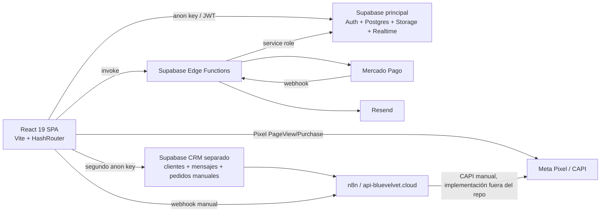
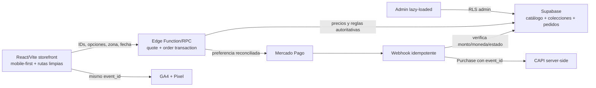

# BLUE VELVET 2.0 — Auditoría técnica, ecommerce y conversión

**Fecha de auditoría:** 5 de agosto de 2026  
**Repositorio auditado:** `C:\Users\aleja\Downloads\blue-velvet-florería`  
**Estado:** auditoría inicial completa; no se modificó código de la aplicación  
**Prioridad rectora:** conversión > velocidad > UX móvil > marca > animaciones

## 1. Resumen ejecutivo

La base actual es una SPA de ecommerce funcional construida con React, Vite y Supabase. Tiene catálogo real, carrito persistente, autenticación, direcciones, reglas de entrega por código postal/colonia, pedidos, panel administrativo, Mercado Pago, transferencia bancaria, correo y un CRM de WhatsApp separado. No se recomienda reemplazar Supabase, Mercado Pago, Storage ni la base de reglas de entrega únicamente por preferencia tecnológica.

La experiencia de compra y el límite de seguridad entre navegador y servidor sí requieren una reconstrucción importante. El proyecto todavía no está listo para recibir tráfico de Meta Ads optimizado a `Purchase`: actualmente obliga a iniciar sesión, no tiene landings de campaña, el catálogo móvil oculta productos bajo filtros, el checkout confía en importes del cliente y el evento `Purchase` puede dispararse para pedidos no pagados o repetirse al recargar.

### Veredicto

- **Conservar:** React/Vite, Supabase, Supabase Auth como opción de cuenta, Supabase Storage, las 845 reglas de cobertura, el catálogo existente, Mercado Pago y su verificación API en webhook, SPEI/manual, correo, administración de productos y el CRM separado mientras se aseguren sus fronteras.
- **Refactorizar:** frontend completo de tienda, modelo comercial de productos, carrito, checkout, creación de pedidos, promociones, fechas de entrega, administración, routing, SEO, carga de imágenes y tracking.
- **Reemplazar:** confirmación de pago desde el navegador, cálculo de precios en cliente como fuente de verdad, `HashRouter`, Tailwind por CDN en producción, Pixel hardcodeado y lógica estacional hardcodeada.
- **Bloqueo recomendado:** no optimizar campañas a `Purchase` hasta corregir los hallazgos P0 de pago, tracking y autorización.

## 2. Hallazgos críticos antes de escalar Meta Ads

| Severidad | Hallazgo | Impacto |
|---|---|---|
| P0 | El navegador crea pedidos, calcula total, envío, extras y descuentos; `create-preference` acepta esos artículos e importes sin reconstruirlos desde base de datos. | Un usuario autenticado puede manipular precios. El backend no es la fuente de verdad. |
| P0 | El total guardado incluye extras y envío, pero la preferencia de Mercado Pago solo incluye `size.price` y descuento. | El importe cobrado puede ser menor que el pedido registrado. |
| P0 | `confirm_order_payment` es `security definer`, acepta cualquier `order_id`, no verifica Mercado Pago y concede ejecución a `anon`. El callback confía en `collection_status=approved` de la URL. | Cualquier pedido conocido puede marcarse como confirmado sin pago real. |
| P0 | `Purchase` se dispara al abrir la confirmación sin exigir estado pagado; también se dispara en SPEI pendiente y se repite al recargar. | Meta aprende de compras falsas/duplicadas y el ROAS queda contaminado. |
| P0 | El checkout exige login/registro. | Fricción severa para tráfico móvil frío de Instagram/Facebook; contradice el requisito guest-first. |
| P0 | `supabase/config.toml` configura `verify_jwt = true` para el webhook de Mercado Pago. | Si esa configuración está desplegada, Mercado Pago no puede autenticar su notificación y el webhook responderá 401. Debe comprobarse en producción. |
| P1 | La preferencia de pago se crea después de enviar correo y vaciar carrito. | Si Mercado Pago falla o el popup se bloquea, el cliente pierde el carrito y ya recibió un correo de pedido. |
| P1 | No existe CAPI para compras web ni deduplicación `event_id`; el CAPI observado es un flujo manual externo para el CRM. | Medición incompleta, baja resiliencia a bloqueadores y posible duplicación con eventos manuales. |
| P1 | No existe GA4 ecommerce. | No hay embudo confiable de `view_item` a `purchase`, atribución ni preservación explícita de UTMs. |
| P1 | La carpeta entregada no es un repositorio Git y las migraciones no reconstruyen el esquema completo. | No hay rollback por commits ni una fuente reproducible de base de datos. |

## 3. Arquitectura actual

### Stack

- **Frontend:** React 19.2, TypeScript 5.8, React Router 7.11, Vite 6.4.
- **Estilos:** utilidades Tailwind cargadas desde `cdn.tailwindcss.com` y configuración inline en `index.html`; no existe pipeline Tailwind local.
- **Backend:** Supabase Postgres, Auth, Storage, Realtime y Edge Functions Deno.
- **Pago:** Mercado Pago Checkout Pro mediante preferencia; SPEI por transferencia manual.
- **Correo:** Resend desde Edge Function.
- **CRM/WhatsApp:** segundo proyecto Supabase y webhooks n8n externos.
- **Hosting inferido:** build estático servido por Apache/cPanel debido a `public/.htaccess`. No hay configuración versionada de Vercel, Netlify, Docker, CI/CD ni hosting declarativo.
- **Estado de control de versiones:** no existe carpeta `.git` en el directorio auditado.

### Entrada y routing

- `index.tsx` monta `AuthProvider`, `HelmetProvider` y `App`.
- `App.tsx` monta `CheckoutProvider`, settings globales, mantenimiento, routing y WhatsApp.
- Se usa `HashRouter`, por lo que las URLs reales son `/#/product/:id`, `/#/checkout/...`, etc.
- `/` muestra directamente `CatalogPage`; la homepage editorial existente está aislada en `/#/home` y no es la entrada principal.
- Todas las páginas, incluidas las de administración y el chat de 913 líneas, se importan de forma estática en el bundle inicial.
- Existe una ruta administrativa duplicada para `/admin/products`.

## 4. Datos y modelos

La consulta pública de solo lectura al proyecto Supabase configurado confirmó:

- 34 productos.
- 7 categorías.
- 0 ocasiones activas en la tabla `occasions`.
- 845 reglas de entrega por CP/colonia.
- 6 complementos.
- 14 settings globales.
- Las 34 imágenes de producto están en Supabase Storage.
- Ningún producto actual tiene `sizes` poblado.
- Ningún producto actual tiene `original_price` poblado.

### Productos

Columnas observadas: `id`, `name`, `price`, `original_price`, `description`, `image`, `category`, `occasions`, `sizes`, `meta_title`, `meta_description`, `created_at`.

Problemas:

- No hay `slug`, `status/active`, stock, disponibilidad, orden, destacado, colección, temporada ni ventana de venta.
- No existen `regular_price`, `sale_price`, `sale_start`, `sale_end` con semántica consistente.
- El backend usa `original_price`, pero el tipo frontend busca `originalPrice`; aun si se poblara, la UI actual no lo leería correctamente.
- `category` es texto en el producto, no una relación por `category_id`; renombrar categorías puede romper filtros.
- `sizes` es JSON y la administración lo soporta, pero no se usa en los 34 productos desplegados. La PDP oculta la selección de tamaño y crea una variante “Standard” implícita.
- Solo existe una imagen por producto; no hay galería, texto alternativo administrable ni focal point.

### Categorías, ocasiones y temporadas

- `categories` solo tiene `id`, `name`, `created_at`.
- No hay activación, vigencia, `slug`, orden, imagen, copy SEO o relación de colección.
- El 5 de agosto de 2026 se mostró “10 de mayo” en producción de datos, exactamente el caso estacional que se desea evitar.
- `occasions` existe, pero está vacía en el proyecto consultado.

### Carrito

- Anónimo: todo el estado de carrito, dirección, dedicatoria y descuento se guarda en `localStorage` bajo `checkoutData`.
- Autenticado: se sincroniza también con `cart_items` y se unen productos desde `products`.
- El contador del header cuenta líneas, no unidades.
- No existe expiración/versionado del shape guardado; un cambio de modelo puede romper `JSON.parse` o rehidratar precios obsoletos.
- Se guarda el objeto completo de variante y complementos del cliente; es útil para UI, pero nunca debe ser fuente autoritativa de precio.

### Pedidos

- `orders`: usuario, total, estado y JSON de entrega/dedicatoria; el esquema real parece tener columnas adicionales no cubiertas por el SQL base.
- `order_items`: snapshot de nombre, cantidad, precio y tamaño, más complementos JSON.
- El pedido y sus líneas se insertan en operaciones separadas, sin transacción. Un fallo intermedio deja pedidos parciales.
- El precio de `order_items` excluye complementos aunque el total declarado sí los incluye.
- El flujo de cupón incrementa uso antes del pago y ejecuta RPC más un fallback cliente; si ambos tienen permiso puede duplicar el contador.

### Direcciones y envío

- `user_addresses` está correctamente orientada a direcciones por usuario y tiene políticas de propiedad.
- `shipping_zones` es una buena base reutilizable: CP, colonia, estado `standard/surcharge/blocked` y recargo.
- La validación de cobertura y el costo se ejecutan en cliente. Deben repetirse en servidor al cotizar/crear el pedido.
- No existe tarifa base explícita; `standard` equivale a $0 y solo `surcharge` agrega importe.

### Settings

Claves desplegadas: contacto, ciudad/estado, redes, mantenimiento, lanzamiento, nombre/descripción de tienda, SEO, WhatsApp y `meta_pixel_id`.

- La UI de administración solo edita seis claves.
- `meta_pixel_id` existe en datos, pero `index.html` hardcodea otro valor y no usa el setting.
- No existen announcement bar, hero, promociones, destacados, horarios, cutoff, días bloqueados ni capacidad.

### Deriva de esquema

La base no es reproducible desde el repositorio:

- `supabase_schema.sql` no crea `products` ni `categories` y contiene un fragmento de trigger incompleto.
- Muchas modificaciones están como SQL suelto en la raíz y no en `supabase/migrations`.
- Las migraciones versionadas solo cubren una parte de settings, addons, SEO, `payment_id` y WhatsApp.
- El CRM usa tablas `customers`, `messages`, `orders`, `crm_settings` y `whatsapp_media`, pero su esquema no está incluido.
- La migración `whatsapp_messages` no coincide con las tablas consumidas por `LiveChatPage`.

## 5. Flujos actuales

### Catálogo y búsqueda

1. `/` carga settings, auth, tracking de visitante y catálogo.
2. Catálogo solicita todos los productos, categorías y ocasiones.
3. Los productos se barajan aleatoriamente en cada refresh.
4. Filtro y búsqueda se realizan totalmente en cliente.
5. La búsqueda solo se envía al presionar Enter.

### Compra

1. PDP carga producto y complementos.
2. Agregar al carrito actualiza contexto/localStorage y, si hay sesión, `cart_items`.
3. Checkout de envío bloquea al usuario anónimo y exige login o registro.
4. La dirección valida CP/colonia desde `shipping_zones`.
5. Fecha/horario usa reglas hardcodeadas en navegador.
6. Dedicatoria requiere destinatario; puede ser anónima o sin mensaje.
7. Pago calcula subtotal, extras, envío y cupón en cliente.
8. El cliente inserta pedido y líneas directamente en Supabase.
9. Se incrementa cupón, se envía correo y se vacía carrito antes de crear la preferencia.
10. Para tarjeta se abre Mercado Pago en otra pestaña y la original queda esperando Realtime/polling.

### Pago y confirmación

- El webhook sí consulta el pago por ID a la API de Mercado Pago antes de actualizar el pedido. Este patrón debe conservarse.
- No compara monto/currency del pago contra el total autoritativo del pedido.
- El callback del navegador también confirma mediante RPC inseguro y debe eliminarse.
- SPEI crea estado `pending_transfer` y muestra datos bancarios/WhatsApp.
- El correo se envía antes de confirmar tarjeta y usa lenguaje de pedido recibido, no de pago confirmado.

### Administración

| Capacidad | Estado actual |
|---|---|
| Productos | Crear/editar/eliminar, precio, categoría, ocasiones, variantes JSON, imagen, meta SEO |
| Categorías | CRUD básico por nombre |
| Ocasiones | CRUD básico; tabla desplegada vacía |
| Complementos | CRUD, tipo, precio y activo |
| Cupones | Crear/listar/eliminar; porcentaje/fijo, expiración y límite |
| Envío | CRUD de CP/colonia, bloqueo y recargo |
| Pedidos | Listado, detalle y estados |
| Usuarios | RPC administrativa no definida en migraciones |
| Settings | Contacto/redes, SEO básico y mantenimiento |
| Hero / announcement | No administrables |
| Colecciones / landings | No existen |
| Stock / disponibilidad | No existen |
| Promoción programada | No existe |
| Destacados / orden | No existen |
| Temporadas | No existe activación/vigencia |

## 6. Qué está bien construido y debe conservarse

1. **Stack compacto:** React + Supabase es suficiente para el volumen actual y puede escalar significativamente sin reescritura.
2. **Catálogo real en base de datos:** la interfaz no depende de los productos demo de `constants.ts` para el catálogo activo.
3. **Storage centralizado:** todas las imágenes activas están en el bucket de Supabase.
4. **Cobertura granular:** 845 reglas de entrega constituyen un activo operativo importante.
5. **Carrito drawer ya existente:** el patrón es correcto; requiere rediseño y accesibilidad, no eliminación.
6. **Direcciones guardadas:** pueden mantenerse como mejora opcional para clientes recurrentes.
7. **Mercado Pago server-to-server:** la consulta del pago real en el webhook es el fundamento correcto.
8. **RLS de propiedad:** direcciones y carrito tienen políticas orientadas a `auth.uid()`.
9. **Snapshot de líneas de pedido:** conservar nombre/precio/configuración histórica en `order_items` es correcto si el snapshot lo genera el servidor.
10. **Administración funcional:** productos, categorías, complementos, cupones, envío y pedidos ya tienen superficies operativas reutilizables.
11. **SPEI y WhatsApp:** deben conservarse como alternativas/asistencia, con estados y medición correctos.
12. **Mantenimiento y settings:** el patrón key/value puede extenderse para configuración simple.

## 7. Qué debe refactorizarse

### Arquitectura de frontend

- Separar storefront, checkout, cuenta y administración mediante carga diferida por ruta.
- Introducir componentes y tokens centralizados; eliminar la acumulación de valores arbitrarios.
- Convertir el root en el híbrido homepage/catálogo solicitado.
- Adoptar URLs limpias con slugs y rutas de colecciones, preservando compatibilidad con IDs y hashes antiguos.
- Crear una capa tipada de acceso a datos y tipos generados desde Supabase.
- Añadir estados de loading/error consistentes, skeletons y boundaries.

### Modelo ecommerce

- Añadir producto activo, stock/disponibilidad, slug, orden/destacado y galería.
- Normalizar promociones con `regular_price`, `sale_price`, `sale_start`, `sale_end` y validación de ventana.
- Crear colecciones y relación producto-colección con `slug`, estado, vigencia, hero/copy/SEO y orden.
- Añadir flags/vigencia a categorías y ocasiones.
- Modelar horarios, cutoff, días bloqueados y excepciones en datos administrables.
- Mantener variantes JSON solo si sus reglas siguen simples; si requieren stock/agenda por variante, normalizarlas.

### Checkout y backend

- Crear un endpoint/RPC server-side de cotización autoritativa que reciba IDs/cantidades/opciones, recupere precios y reglas, valide cupón/envío/fecha y devuelva un quote firmado o persistido.
- Crear pedido y líneas en una transacción server-side idempotente.
- Permitir guest checkout mediante email/teléfono y token de pedido; la cuenta debe ser opcional.
- Crear la preferencia desde el pedido cotizado, no desde objetos del navegador.
- Incluir envío y complementos exactamente una vez y reconciliar total con Mercado Pago.
- Consumir cupón solo al confirmar pago/reserva según regla de negocio.
- Mantener carrito si la creación de pago falla.
- Separar estados `draft`, `pending_payment`, `pending_transfer`, `paid`, `confirmed`, `preparing`, `out_for_delivery`, `delivered`, `cancelled`, `refunded` según operación real.

## 8. Qué debe reemplazarse

- `rpc_confirm_payment.sql` y toda confirmación basada en query params del frontend.
- Cálculo de precio final basado únicamente en `CheckoutContext`/`localStorage`.
- `HashRouter` como URL pública de ecommerce.
- Tailwind CDN y Material Symbols remotos como infraestructura de estilos/iconos de producción.
- Fechas de San Valentín 2026 hardcodeadas en `CheckoutProvider` y `Shipping`.
- Hero slider hardcodeado de 600–700 px y sus imágenes externas.
- Productos demo en `constants.ts` si ya no sirven a pruebas/seed.
- Pixel ID y endpoint CAPI manual hardcodeados en frontend.
- `alert()` como manejo principal de errores de checkout.

## 9. Auditoría UX/CRO

### Móvil 390×844

La prueba renderizada confirmó:

- El primer viewport del catálogo contiene header, breadcrumb, panel completo de categorías y filtro de precio. **No aparece ningún producto antes del scroll.**
- “10 de mayo” permanece visible en agosto.
- La cuadrícula móvil usa una sola columna, reduciendo velocidad de exploración.
- Hay controles de grid/list y precio que ocupan espacio valioso para un catálogo de 34 productos.
- El header prioriza también cuenta; la búsqueda queda oculta dentro del menú en móvil.
- Los botones de icono se anuncian como `shopping_cart`, `account_circle` y `menu`, no con nombres accesibles en español.

### Homepage

- `/` no es la homepage híbrida; abre un catálogo con sidebar.
- `Home.tsx` existe en `/home`, pero muestra un carrusel alto, logos de confianza no comprobados y colecciones hardcodeadas antes de productos.
- No existe announcement bar, promoción destacada administrable, ocasiones o social proof real.

### Catálogo y cards

- Cards cuadradas con bordes marcados, overlay hover y CTA invisible en touch.
- Precio sin formato `MXN`, sin “desde”, disponibilidad, promoción ni CTA directo.
- Orden aleatorio destruye consistencia entre anuncio, visita y regreso; impide merchandising administrable.
- Loading es spinner central, no skeleton con layout estable.
- No hay paginación/virtualización; hoy 34 productos son manejables, pero no escala.

### PDP

- Solo una imagen cuadrada; no galería ni 4:5.
- En 390×844 el CTA queda debajo del fold y no es sticky.
- WhatsApp cubre opciones de complementos.
- No permite elegir fecha, validar cobertura ni escribir dedicatoria antes de agregar.
- No comunica entrega, disponibilidad, confianza, devoluciones/cambios o personalización cerca del CTA.
- La promoción no funciona por el mismatch `original_price`/`originalPrice`.
- No existe `ViewContent` ni `view_item`.

### Cart drawer

- Buena base conceptual y edición sin recarga.
- Falta focus trap, `role=dialog`, nombre accesible, bloqueo de scroll y restauración de foco.
- Botones de cantidad de 24 px son menores al touch target recomendado.
- Subtotal usa precios del cliente y no comunica envío/validación.
- No existe estimador de zona/fecha ni recomendaciones de extras contextuales.

### Checkout

- La barrera de login es el mayor problema CRO.
- Tres páginas separadas pueden ser válidas, pero el resumen desaparece en móvil durante dedicatoria.
- Formularios validan principalmente presencia; teléfono, CP, fecha y coherencia de estado son débiles.
- `min=today` usa UTC (`toISOString`) y puede comportarse incorrectamente cerca de medianoche en Chihuahua.
- “Hoy” se habilita solo por hora actual, sin cutoff configurable, tiempo de preparación, días sin entrega o capacidad.
- Slots hardcodeados se solapan en ventanas de cinco horas cada hora.
- El botón “Volver” de envío enlaza siempre a `/product/1`, un producto demo inexistente en el catálogo UUID.
- Los errores no siempre tienen texto asociado y se usan `alert()` en pago.
- El popup de Mercado Pago se abre después de varias operaciones async y puede ser bloqueado.

### Confirmación

- Presenta información útil de pedido, entrega y SPEI.
- Duplica `fetchOrder()` al montar.
- Muestra éxito sin comprobar correctamente estado pagado.
- Tiene datos bancarios personales hardcodeados en código; deben administrarse como secretos/configuración operativa controlada.

## 10. Performance

### Evidencia

- Build exitoso: 141 módulos.
- Bundle único: **682.95 kB minificado / 183.76 kB gzip**.
- Vite advierte chunk mayor a 500 kB.
- El bundle incluye storefront, cuenta, checkout, todo el admin y Live Chat.
- `/index.css` no existe durante build y queda como referencia que resolverá a 404.
- Tailwind CDN emite advertencia explícita de no usarlo en producción.
- `dist` contiene múltiples bundles antiguos de 636–683 kB, aunque el HTML solo referencia uno.
- Assets locales grandes: logo PNG 1.64 MB, textura 933 kB, foto WebP 852 kB y textura 741 kB.

### Problemas

- Sin code splitting por ruta.
- Sin `srcset`, `sizes`, AVIF/WebP generado, transformaciones de Supabase ni thumbnails.
- Ninguna imagen de la tienda declara `width`, `height`, `loading` o prioridad LCP.
- Cards y PDP usan `object-cover` sin focal point; riesgo de cortar ramos.
- Imágenes de hero como CSS background no pueden usar responsive image/preload de forma correcta.
- Google Fonts, Material Symbols, Tailwind CDN y Pixel agregan terceros al critical path.
- La app hace solicitudes separadas de settings en App, WhatsApp y contacto, además del contador propio.
- Catálogo descarga los 34 productos completos y baraja en cliente.
- No hay presupuesto de performance, Lighthouse CI, RUM ni medición de Web Vitals.

### Objetivo

Conservando Vite se puede alcanzar LCP <2.5 s, CLS cercano a 0 e INP <200 ms mediante CSS compilado, route splitting, responsive images, dimensiones explícitas, prioridad del LCP, fuentes locales/subset y reducción de terceros.

## 11. SEO técnico

### Estado positivo

- Existen `robots.txt`, `sitemap.xml`, títulos/descripciones y OpenGraph básico.
- Producto puede guardar `meta_title` y `meta_description`.
- `.htaccess` permite fallback SPA y caching de assets.

### Problemas

- `HashRouter` produce URLs con `#`; los fragments no son rutas HTTP indexables normales.
- El sitemap declara `/catalog`, `/about`, etc., mientras la aplicación enlaza `/#/catalog`, `/#/about`.
- El sitemap es estático, omite los 34 productos y landings, e incluye login/registro.
- No hay canonical.
- No hay Product, Offer, Organization, LocalBusiness/Florist, BreadcrumbList ni WebSite/SearchAction structured data.
- Los metadatos de producto se generan solo en cliente; crawlers sociales pueden recibir el HTML genérico antes de ejecutar React.
- `og:url` usa `window.location.href`, incluyendo hashes y parámetros.
- `og:image` no garantiza dimensiones/formato/URL absoluta optimizada.
- `<html lang="en">` es incorrecto para contenido español de México.
- Las rutas inexistentes reciben `index.html` con HTTP 200 bajo el rewrite, generando soft 404.
- Productos usan UUID, sin slugs descriptivos.
- No existe inventario de URLs actuales, redirects 301 ni reglas de migración.
- No hay noindex para checkout, cuenta, login o admin.

## 12. Analytics, Meta Ads y atribución

### Meta actual

- Pixel cargado en `index.html` con ID hardcodeado.
- `PageView` se dispara una sola vez al cargar documento; no se repite correctamente en navegación SPA.
- Solo existe `Purchase` adicional en `OrderConfirmation`.
- Faltan `ViewContent`, `Search`, `AddToCart`, `InitiateCheckout` y `AddPaymentInfo`.
- `Purchase.content_ids` usa IDs de `order_items`, no IDs de producto.
- No incluye nombres de contenido consistentes.
- No hay `event_id`, deduplicación ni CAPI para checkout web.
- No se valida estado `paid/confirmed` antes de `Purchase`.
- Recargar confirmación repite el evento.
- SPEI pendiente dispara `Purchase`.
- El panel manual envía compras de WhatsApp a un webhook n8n externo, pero el producto escrito en el formulario ni siquiera se incluye en el payload.
- El endpoint manual está hardcodeado y puede recibir eventos fuera de la UI si no tiene autenticación server-side.
- La lógica interna de n8n/CAPI no está en el repositorio; no se pudo auditar hashing, consentimiento, `action_source`, deduplicación o calidad de match.

### GA4 actual

- No se encontró `gtag`, Google Tag Manager ni SDK GA4.
- No existen eventos ecommerce.
- No existe persistencia explícita de `utm_source`, `utm_medium`, `utm_campaign`, `utm_content`, `utm_term`, `fbclid` o landing inicial en pedido.

### Arquitectura recomendada

- Crear una capa única de eventos tipados y consent-aware.
- Generar `event_id` estable por acción/pedido.
- Browser Pixel y Edge Function CAPI deben compartir `event_id`.
- `Purchase` debe salir únicamente de transición server-side a pagado/confirmado, ser idempotente por pedido y reconciliar valor/currency.
- Persistir first-touch y last-touch en sesión/quote/pedido.
- Crear `ANALYTICS_TRACKING.md` durante la fase de implementación, con payloads, triggers, dedup, QA y política de privacidad.

## 13. Seguridad

### Autorización y RLS

- Productos sí tienen políticas públicas de lectura y administrativas por rol.
- SQL de `site_settings`, `addons` y Storage concede escritura a **cualquier usuario autenticado**, no solo admin.
- `profiles` se declara públicamente legible.
- `unique_visitors` permite `for all using(true)` a público; las métricas pueden manipularse y las filas alterarse.
- Cupones son públicamente enumerables con código, valor, límite y uso.
- El panel admin está protegido por rol en la UI, pero la seguridad real depende de RLS inconsistentes entre scripts.
- Live Chat autentica contra el Supabase principal, pero opera con un segundo cliente Supabase CRM. El JWT del proyecto principal no autoriza automáticamente el segundo proyecto; el CRM puede estar roto o depender de políticas anon permisivas. Su esquema/RLS no está en el repo.

### Integridad de pedidos/pagos

- Precio, descuento, envío, fecha y complementos no se revalidan server-side.
- No hay idempotency key para creación de pedido/preferencia.
- No hay transacción para pedido + items + cupón.
- Webhook verifica estado con Mercado Pago, pero no monto, moneda ni coincidencia exacta con quote.
- El RPC público permite confirmación fraudulenta.
- No se manejan explícitamente reembolsos, contracargos o cancelaciones posteriores.

### Inputs y APIs

- La validación es mayormente `required`/presencia y vive en cliente.
- El HTML del correo concatena nombre, dirección, productos y complementos sin escaping.
- `order-confirmation` usa service role, acepta `orderId`, no comprueba propiedad explícita y puede reenviar correos repetidamente.
- Edge Functions usan CORS `*`.
- No hay rate limiting visible para login complementario, cupones, órdenes, correos, contador o webhook manual.
- El endpoint n8n de eventos manuales está en frontend y no muestra firma/autorización.
- No hay Content-Security-Policy ni cabeceras de seguridad versionadas más allá de cache.

### Variables de entorno

- `.env.local` contiene valores reales y está ignorado por `.gitignore`, pero no existe `.env.example` ni inventario de secretos.
- `vite.config.ts` define `GEMINI_API_KEY` como reemplazo de cliente. Aunque no se observó uso, esa configuración podría incrustar un secreto server-side en el bundle si se referencia.
- La URL exacta del webhook de Mercado Pago y el proyecto Supabase están hardcodeados.
- Se deben rotar/revisar secretos después de establecer repositorio y staging, especialmente cualquier token que haya circulado fuera de un secret manager.

## 14. Accesibilidad

- HTML semántico básico, `alt` en imágenes y algunos labels son puntos de partida positivos.
- Icon buttons carecen de `aria-label` útil.
- Drawer y menús no controlan foco ni estados `aria-expanded`.
- El drawer no se identifica como diálogo modal.
- Touch targets de cantidad son de 24 px.
- Overlays hover no tienen equivalente claro en touch/teclado.
- Focus styles se eliminan en varios inputs (`focus:outline-0`, `focus:ring-0`).
- Errores se comunican principalmente por borde/color y no con `aria-describedby`/live region.
- El carrusel automático no ofrece pausa ni respeta `prefers-reduced-motion`.
- WhatsApp animado y flotante puede interferir con contenido/CTA.
- Debe validarse WCAG 2.2 AA en contraste, teclado, zoom 200%, lector de pantalla y reduced motion.

## 15. Dependencias, calidad y pruebas

### Comandos ejecutados

| Comando | Resultado |
|---|---|
| `npm run build -- --outDir <temporal>` | Pasa con warnings; bundle 682.95 kB y `/index.css` ausente |
| `npx tsc --noEmit` | Falla con 23 errores: 10 en `OrderConfirmation` y 13 por mezclar Deno Edge Functions con tsconfig web |
| `npm audit --json` | 8 vulnerabilidades: 7 high y 1 low |

Dependencias afectadas observadas: `react-router-dom` (directa), `vite` (directa), `react-router`, `rollup`, `postcss`, `picomatch`, `ws` y `@babel/core`.

### Ausencias

- No hay script/configuración de lint.
- No hay script de typecheck separado para web y Edge Functions.
- No hay tests unitarios, de integración o E2E.
- No hay CI.
- No hay visual regression ni matriz responsive.
- `tsc_output.txt` es un artefacto manual, no una validación automatizada.

## 16. Riesgos de migración

| Riesgo | Nivel | Mitigación requerida |
|---|---|---|
| No hay historial Git local | Crítico | Inicializar repositorio privado desde snapshot verificado antes de implementar; etiquetar baseline. |
| Esquema/migraciones incompletas | Crítico | Dump de esquema, funciones, triggers, políticas y storage; convertir a migraciones reproducibles. |
| Dos proyectos Supabase | Alto | Inventariar ownership, RLS, backups, secretos y contratos entre ecommerce/CRM. |
| Pagos actuales inconsistentes | Crítico | Pruebas sandbox, quotes server-side, webhook idempotente y reconciliación antes de rollout. |
| URLs hash actuales | Alto | Inventario Analytics/Search Console; rutas limpias, aliases y puente de hashes antiguos. |
| Tracking sin baseline confiable | Alto | Registrar baseline, crear entorno test, Test Events de Meta y DebugView de GA4. |
| Datos estacionales hardcodeados | Alto | Migrar a configuración con vigencia y zona horaria `America/Chihuahua`/regla comercial confirmada. |
| Carrito local shape mutable | Medio | Versionar/migrar almacenamiento y no perder carritos existentes durante despliegue. |
| Settings con permisos amplios | Alto | Corregir RLS antes de ampliar administración. |
| Host no documentado | Alto | Documentar Apache/cPanel, DNS, SSL, cache y proceso exacto de deploy/rollback. |

## 17. Arquitectura objetivo recomendada

No requiere cambiar de stack:

Principios:

1. El navegador propone; el servidor cotiza y decide.
2. Guest-first con cuenta opcional posterior a compra.
3. Una sola fuente de verdad para total, estado de pago y `Purchase`.
4. Contenido de campaña administrable y con vigencia.
5. Frontend por rutas/chunks; admin no forma parte del payload de compra.
6. URLs limpias, indexables y estables.
7. Rollout gradual sobre los sistemas comprobados.

## 18. Orden recomendado de implementación después de la auditoría

### Fase 0 — Seguridad e integridad comercial

- Crear Git baseline, backups y staging.
- Capturar esquema real de ambos Supabase.
- Corregir RLS de settings/addons/storage/visitors/CRM.
- Eliminar confirmación frontend/RPC anon.
- Implementar quote/pedido/preferencia server-side e idempotencia.
- Verificar webhook sin JWT externo, monto, moneda y estados.

### Fase 1 — Fundamentos storefront

- Design tokens, CSS compilado, componentes base y route splitting.
- BrowserRouter, slugs, redirects/bridge hash.
- Layout global, announcement, header móvil, búsqueda y cart drawer accesible.
- Modelo de promociones, categorías activas, colecciones y settings de contenido.

### Fase 2 — Conversión

- Homepage catálogo híbrida.
- Cards 4:5, skeletons, categorías chips y merchandising.
- PDP con galería, fecha, cobertura, dedicatoria, extras y sticky CTA.
- Guest checkout, resumen persistente, errores claros y confirmación por estado.
- Landings `/rosas`, `/promo-rosas`, ocasiones y temporadas.

### Fase 3 — Medición, SEO y performance

- Data layer, GA4 ecommerce, Pixel, CAPI y deduplicación.
- Persistencia UTM/fbclid y QA de atribución.
- Metadata server-renderable/prerender, sitemap dinámico, canonicals y JSON-LD.
- Responsive image pipeline, fuentes, budgets y Web Vitals.

### Fase 4 — Administración, QA y despliegue

- Hero, announcement, temporadas, destacados, promociones y colecciones.
- Tests unit/integration/E2E, accesibilidad y matriz responsive.
- Staging con pruebas de pago, analítica y rollback.
- Crear `ANALYTICS_TRACKING.md`, `BLUE_VELVET_V2_QA.md` y `BLUE_VELVET_V2_MIGRATION.md` con la implementación real, no como documentación aspiracional.

## 19. Decisiones de negocio que no deben asumirse en código

Estas preguntas pueden resolverse al iniciar la fase correspondiente:

- Cutoff exacto para entrega el mismo día y tiempo mínimo de preparación.
- Días/horarios operativos y política para festivos/fechas pico.
- Tarifa base de entrega vs zonas gratis/con recargo.
- Capacidad diaria o por franja.
- Política de stock y sustitución floral.
- Cuándo un SPEI manual se considera `Purchase`: al crear pedido, recibir comprobante o verificar depósito. Recomendación: solo al verificar pago.
- Alcance de Apple Pay/Google Pay soportado por la cuenta/configuración actual de Mercado Pago.
- Propietario y estrategia de integración del CRM Supabase/n8n.
- Evidencia real autorizada para social proof.

## 20. Conclusión

Blue Velvet 2.0 debe ser una reconstrucción del storefront y del límite de confianza del ecommerce, no una reescritura indiscriminada del negocio. La infraestructura actual contiene activos que vale la pena proteger: catálogo, imágenes, cobertura, pedidos, Storage, Auth opcional, Mercado Pago, SPEI, correo y CRM. La prioridad inmediata no es el look visual, sino asegurar que el total cobrado sea correcto, que solo el backend confirme pagos y que `Purchase` represente una venta real una sola vez.

Una vez cerrados esos P0, la nueva experiencia puede construirse por fases sobre el stack actual: mobile-first, productos visibles de inmediato, checkout invitado, landings de campaña, diseño editorial premium y medición confiable.
