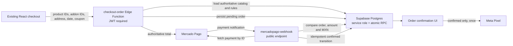

# Blue Velvet Phase 0 Security Design

**Date:** 2026-08-05
**Status:** Approved
**Production architecture:** Cloudflare Pages + Supabase Cloud

## Goal

Make the current checkout trustworthy before the Blue Velvet 2.0 redesign: every payable amount must be calculated on the server, only Mercado Pago's verified webhook may confirm card payments, database write access must be restricted, and Meta `Purchase` must represent a confirmed order exactly once in the browser.

## Scope

Phase 0 includes:

1. A local Git baseline and production database backup.
2. An additive database migration for atomic order persistence.
3. A new authenticated `checkout-order` Edge Function.
4. A hardened Mercado Pago webhook.
5. Removal of browser-side order creation and payment confirmation.
6. Restrictive RLS for orders, order items, coupons, settings, addons, product storage, and visitor metrics.
7. Decommissioning unsafe legacy functions without changing their URLs until the new frontend is live.
8. Correct browser `Purchase` gating and deduplication.
9. Automated domain tests, build, typecheck, and a production smoke test.
10. Deployment through the existing Cloudflare Pages Git integration.

## Non-goals

The following belong to later phases:

- Moving Supabase to private infrastructure.
- Guest checkout.
- Homepage, design system, catalog, PDP, or checkout visual redesign.
- GA4, Meta CAPI, campaign landing pages, SEO routing, or promotion CMS.
- Replacing Mercado Pago, SPEI, Supabase, Cloudflare Pages, or the separate CRM.

## Constraints

- Existing authenticated checkout remains functional during Phase 0.
- Current product, shipping zone, addon, coupon, address, order, and customer data must be preserved.
- No live database restriction is applied until the compatible frontend and Edge Function are ready.
- Card payments are confirmed only by a server-to-server Mercado Pago API lookup.
- SPEI remains `pending_transfer`; it is never treated as a paid purchase automatically.
- The production deployment must have a documented rollback point for Supabase and Cloudflare Pages.

## Approaches considered

### 1. Harden the existing direct-client flow

Add more frontend validation and tighten a few RLS rules while keeping browser inserts. This is fast but cannot make prices authoritative: an authenticated client can still submit altered totals and snapshots. Rejected.

### 2. Server-authoritative checkout on the current stack

Add one Edge Function that authenticates the user, loads all commercial data from Supabase, calculates the quote, persists the order atomically, and creates the Mercado Pago preference. Preserve the current UI and infrastructure. This is the approved approach because it closes the trust boundary with the least migration risk.

### 3. Rebuild checkout and infrastructure together

Combine guest checkout, new UI, new data model, tracking, and hosting changes. This could produce the final architecture in one release but has the largest outage and regression surface. Rejected for Phase 0.

## Target architecture

## Component boundaries

### `checkout-domain`

A pure TypeScript module with no Deno, Supabase, or Mercado Pago imports. It owns:

- Normalizing quantities and monetary values.
- Resolving a selected product price from the database product and optional size name.
- Resolving active addon prices from database rows.
- Computing subtotal, shipping, discount, and grand total in integer centavos.
- Validating fixed and percentage coupons, expiration, activity, and usage limits.
- Rejecting empty carts, unknown IDs, invalid quantities, non-positive totals, unsupported currency, and invalid delivery zones.
- Building a deterministic order snapshot for persistence and payment.

This module is testable with Vitest and is the only place allowed to define checkout arithmetic.

### `checkout-order` Edge Function

The function:

1. Accepts only `POST` and CORS preflight.
2. Requires a valid user JWT and obtains the authenticated user from Supabase Auth.
3. Accepts product IDs, quantities, optional size names, addon IDs, shipping fields, message fields, payment method, and coupon code. It never accepts prices or discount amounts.
4. Loads products, addons, coupon, and the matching shipping zone with the service role.
5. Uses `checkout-domain` to produce the authoritative quote.
6. Calls a service-role-only SQL function to insert the order and all items atomically.
7. For card payments, creates one Mercado Pago preference whose positive amount exactly equals the persisted order total.
8. Stores the Mercado Pago preference ID on the order.
9. Returns `orderId`, authoritative totals, and `initPoint` for card; returns `orderId` and status for SPEI.
10. Uses stable error codes and never returns secrets or stack traces.

The function is idempotent per client-generated checkout attempt ID. Retrying the same attempt returns the existing order/preference instead of creating duplicates.

### Atomic order RPC

A SQL `security definer` function inserts the order and its item snapshots in one transaction. It:

- Is owned by a controlled database role.
- Sets an explicit safe `search_path`.
- Is executable only by `service_role`.
- Accepts already validated server snapshots, never raw anonymous input.
- Records the attempt ID with a unique constraint.
- Does not mark card or SPEI orders as paid.

### Mercado Pago webhook

The endpoint remains unauthenticated at the gateway because Mercado Pago cannot send a Supabase JWT. It is safe because it:

1. Accepts payment notifications only.
2. Fetches the payment by ID using `MP_ACCESS_TOKEN`.
3. Requires `status=approved`, `currency_id=MXN`, a valid UUID `external_reference`, and a transaction amount equal to the persisted order total.
4. Rejects mismatches without confirming the order.
5. Performs an idempotent transition from `pending_payment` to `confirmed` and stores the payment ID.
6. Treats duplicate approved notifications as successful no-ops.
7. Never trusts status, amount, or order ID from the browser callback.

### Legacy functions

- `create-preference` is replaced by a compatibility handler requiring authentication and returning a deprecation response after the frontend cutover.
- `order-confirmation` is no longer callable by the browser. Its public behavior is disabled; email delivery will be invoked only after an appropriate server-side order transition.
- `confirm_order_payment` is removed after the new frontend no longer calls it.

### Frontend checkout

`Payment.tsx` stops inserting `orders` and `order_items`, reading coupon values, incrementing coupon usage, sending confirmation email, and creating preferences from client prices. It sends IDs and customer-entered fulfillment data to `checkout-order`.

The cart is cleared only after the server returns a persisted order and, for card, a valid Mercado Pago `initPoint`. On failure, cart and form state remain intact.

`ConfirmationCallback.tsx` becomes display/navigation only. It cannot update an order. The waiting page observes the server-confirmed status.

### Purchase tracking

`OrderConfirmation.tsx` emits browser `Purchase` only when:

- The order status is `confirmed` or `paid`.
- It is not a history view.
- A local idempotency key for that order has not already been recorded.

The event uses product IDs from `order_items`, the persisted total, `MXN`, and the order ID. `pending_transfer`, `pending_payment`, reloads, and history views do not emit Purchase. CAPI deduplication is deferred to the analytics phase.

## RLS design

The restrictive migration is applied only after the new production frontend is healthy.

- `orders`: users may read their own orders; admins may read/update all; browser insert/update is removed.
- `order_items`: users may read items belonging to their orders; admins may read all; browser insert is removed.
- `coupons`: public enumeration is removed; admins manage coupons; validation occurs through `checkout-order`.
- `site_settings`: public read remains; writes require an admin profile.
- `addons`: public read remains; writes require an admin profile.
- `storage.objects` for `products`: public read remains; write/delete requires an admin profile.
- `unique_visitors`: anonymous `FOR ALL` is removed. The unauthenticated visitor upsert is disabled until a rate-limited analytics replacement exists; admins retain read access.
- The `is_admin()` helper is `security definer`, has a fixed `search_path`, and is not exposed as a general privilege-escalation surface.

## Error handling

| Condition | Behavior |
|---|---|
| Missing/invalid JWT | 401; checkout keeps all state and prompts reauthentication |
| Unknown/inactive product or addon | 409 with a cart-refresh message |
| Coupon invalid/expired/exhausted | 422 with a coupon-specific message |
| Unsupported or blocked zone | 422 with a delivery coverage message |
| Stored price changed | Server returns the new authoritative total before payment creation |
| Database insert fails | No partial order because the RPC transaction rolls back |
| Mercado Pago preference fails | Order remains `pending_payment`; cart is retained and retry reuses attempt ID |
| Webhook amount/currency mismatch | Order remains pending; structured error is logged |
| Duplicate webhook | 200 no-op after verifying the same payment/order |
| Cloudflare deployment regression | Roll back to the previous Pages production deployment |

## Testing strategy

### Unit tests

- Price selection uses database values and ignores client prices.
- Addons are priced from active database rows.
- Shipping surcharge is included once.
- Fixed and percentage coupons are bounded and rounded in centavos.
- Expired, inactive, exhausted, and unknown coupons fail.
- Empty carts, invalid quantities, duplicate/unknown IDs, and non-positive totals fail.
- Mercado Pago payload total equals the persisted order total.
- Webhook validation accepts matching approved MXN payments and rejects mismatches.
- Purchase eligibility excludes pending/SPEI/history/duplicate states.

### Static verification

- Separate web and Edge Function TypeScript configurations.
- ESLint for frontend and shared domain modules.
- Production Vite build.
- Dependency audit with explicit review of unresolved findings.

### Production smoke test

Use a low-value test product or Mercado Pago test credentials without creating a false production conversion. Verify:

1. Login and cart persistence.
2. Correct product, addon, shipping, coupon, and total.
3. Mercado Pago preference amount.
4. Pending status before payment.
5. Confirmed status only after approved webhook.
6. Confirmation page and one browser Purchase.
7. Rejected payment retains a recoverable order/cart path.
8. SPEI remains pending and emits no Purchase.

## Deployment sequence

1. Create a local Git baseline; verify `.env.local`, `node_modules`, and `dist` are ignored.
2. Export roles, schema, and data from the linked Supabase project to an encrypted/local backup location outside Git.
3. Capture current function versions and Cloudflare production deployment as rollback identifiers.
4. Add tests and implement shared domain logic.
5. Apply an additive migration containing columns, constraints, and the atomic service-role RPC.
6. Deploy `checkout-order` with JWT verification.
7. Deploy the hardened Mercado Pago webhook without JWT gateway verification.
8. Push a non-production branch to obtain a Cloudflare Pages preview and run checkout smoke tests.
9. Deploy the compatible frontend to `main` and verify production reads/orders.
10. Apply the restrictive RLS migration and remove `confirm_order_payment`.
11. Deploy the disabled legacy handlers.
12. Run the production smoke test and inspect Supabase/Cloudflare logs.

## Rollback

- Frontend: Cloudflare Pages rollback to the immediately previous successful production deployment.
- Edge Functions: redeploy the captured previous source/version only if the restrictive database migration has not been applied; otherwise use the new frontend/function set together.
- Database: restrictive policies have an explicit down migration restoring only the prior functional policies. Order data created after cutover is never deleted during rollback.
- Full database restore is the last resort and requires a maintenance window because it would discard post-backup orders.

## Success criteria

- No client request can choose product, addon, shipping, or coupon monetary values.
- Mercado Pago payable amount equals `orders.total_amount`.
- Browser callbacks cannot confirm orders.
- Only an approved, matching Mercado Pago API response confirms card payment.
- SPEI pending orders never emit Purchase.
- Reloading confirmation does not emit a second browser Purchase.
- Existing admin management remains usable under admin-only RLS.
- Production has a tested Cloudflare rollback and a Supabase backup.
